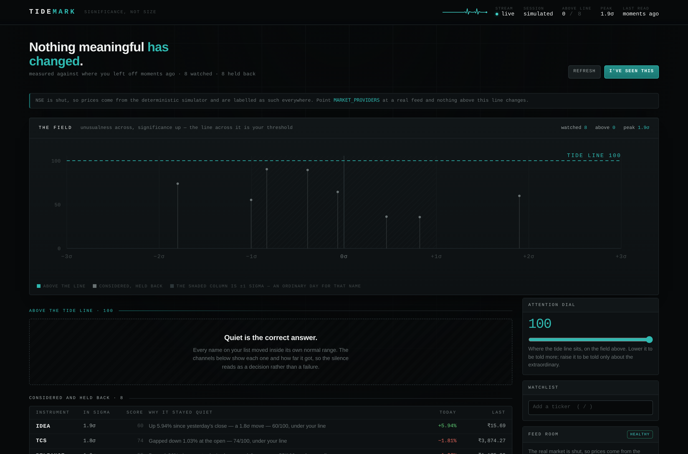
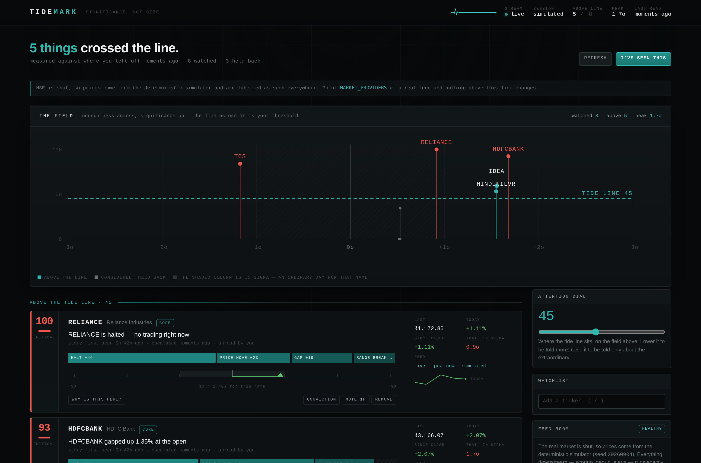
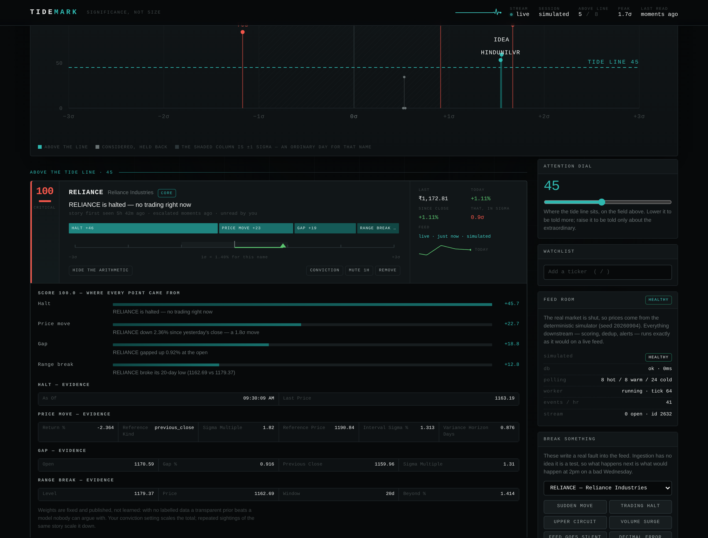
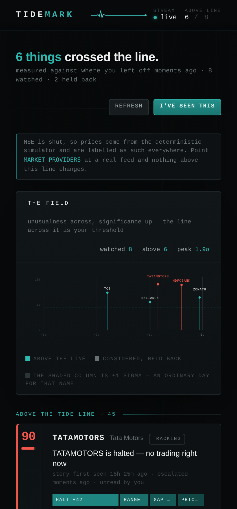

# Tidemark

**A market watchlist that measures change in sigmas, not percents — and stays quiet when nothing meaningful happened.**

Built for *Code, by Groww* 2026 · Smart Market Watchlist · [Product thesis](docs/PRODUCT.md) · [Architecture](docs/ARCHITECTURE.md) · [Decisions](docs/DECISIONS.md) · [Edge cases](docs/EDGE_CASES.md) · [Scaling](docs/SCALING.md) · [Demo script](docs/DEMO.md)

---

## The one idea

The brief says: *don't build the obvious watchlist.* The obvious watchlist is a
table of tickers, last price, and a red or green percentage. It answers "what
are the numbers?" — a question you can answer yourself in four seconds.

The question it does **not** answer is the one you actually opened the app to
ask: **has anything happened that I need to do something about?**

A watchlist cannot answer that with percentages, because a percentage is not
comparable across instruments. On a normal day:

| | typical daily move | a −2% day is… |
|---|---|---|
| HINDUNILVR | ~1.0% | a genuinely unusual session |
| SUZLON | ~4.0% | Tuesday |

Sorting a watchlist by `% change` therefore sorts it by *how volatile each name
is*, and puts the same small-caps at the top every single day. Tidemark
normalises every move by that instrument's own volatility, over the market time
that actually elapsed, and ranks by how *unusual* the move is rather than how
big it is.

The result is a screen that is often almost empty — and says so on purpose:

> **Nothing meaningful has changed.**
> SUZLON +3.99% — 1.0σ, an ordinary move for this name.

That empty state is the product. Everything else exists to make it trustworthy.



Read the bottom table in that screenshot: SUZLON is up **3.99%** and held back,
because 3.99% is a 1.0σ day for SUZLON. That is the whole idea.

---

## What it does

- **"Since you last checked."** Every reader has a server-side watermark per
  instrument — the price they saw and the events they read. Come back two hours
  later and the app diffs against *that*, not against yesterday's close. Because
  the watermark lives on the server, your phone and your laptop agree.
- **Ranks by significance, not size.** A 0–100 score built from ten detectors
  (σ-normalised move, overnight gap, volume against the *shape* of a normal day,
  52-week and 20-day breaks, direction flips since your last visit, your own
  price alerts, circuit bands, halts, spread blow-outs, feed outages, corporate
  actions).
- **Shows its working.** Every point in the score is attributed to a named
  signal with the evidence behind it. A ranking you cannot interrogate is one
  you stop trusting the first time it is wrong.
- **Escalates instead of nagging.** A stock drifting up all afternoon produces
  one event that escalates 1σ → 2σ → 3σ, not 240 notifications. Escalation is a
  unique index in Postgres, not a hope about how often the worker runs.
- **Never pretends about data.** Every price carries an age and a freshness
  state. A silent feed during an open market is itself an event. A print that
  implies an impossible move is rejected before it can become a 52-week low.
- **Lets you break it on purpose.** The "Break something" panel injects real
  faults — halts, decimal errors, silent feeds, an upstream outage. Ingestion
  has no idea it is being tested.

---

## Run it

### Fastest — Docker

```bash
docker compose up --build
# → http://localhost:3000
```

Migrations, universe seeding, baseline backfill and the ingestion worker all
start themselves. There is no setup step to remember.

### Local

Requires Node 22+ and PostgreSQL 16+.

```bash
createdb tidemark
cp .env.example .env          # then set DATABASE_URL and SESSION_SECRET
npm install
npm run db:seed               # migrate + seed universe + build baselines
npm run dev                   # → http://localhost:3000
```

`npm run db:seed` is optional — the app does the same work at boot — but running
it up front means the first screen you see is already scored against a full year
of volatility history rather than defaults.

### Against a real feed

```bash
MARKET_PROVIDERS=finnhub,simulated FINNHUB_API_KEY=... npm run dev
```

Nothing in the domain, the API or the UI changes. The provider seam is the only
thing that knows the difference, and the simulator stays behind the real feed as
a labelled fallback.

### Deploy it

`render.yaml` is a Render blueprint: one web service from the Dockerfile, one
Postgres, both on the free tier.

    Render dashboard → New → Blueprint → select this repository

There is no release command and no setup step. Migrations, the universe seed,
the baseline backfill and the ingestion worker all start themselves from
`instrumentation.ts`, and `/api/health` is wired as the health check so a failed
deploy says which of the database, the worker or a provider is at fault.

Two things to know about the free tier: the service sleeps after 15 minutes of
inactivity and takes about a minute to wake and re-seed, and the free database
expires 30 days after creation.

---

## What it looks like with something happening



The hero is **the field**: every watched instrument plotted at once —
unusualness in sigmas across, significance up — with your threshold drawn as a
horizontal accent line. Whatever rises above it interrupts you. Whatever does not,
does not. It is the entire product in one picture, and it updates live.

Below it, each name that cleared the line takes its own score apart in line:
which detector contributed how many points, as a segmented bar, without anyone
having to click anything.

Open "Why is this here?" and the arithmetic goes further, down to the evidence
behind every signal:



<details>
<summary>Mobile</summary>



</details>

---

## What to look at first

If you have five minutes, [docs/DEMO.md](docs/DEMO.md) is the guided version.
If you have thirty seconds:

1. **The held-back table.** Find a name that moved more, in percent, than
   anything above the tide line. Read the reason next to it. That is the whole
   product.
2. **The field**, and the tide line running across it. Drag the attention
   dial in the right rail and watch the line move through the marks.
3. **"Why is this here?"** on any strip. Every point of the score, attributed,
   with the evidence.
4. **Break something → Decimal error.** Watch the bad print get rejected and the
   instrument switch to "no fresh data" instead of showing a wrong number.
5. **Break something → Provider down.** Watch the circuit breaker trip in the
   Feed Room panel, then recover on its own.

---

## How it is put together

```
src/
  core/                   pure domain — no I/O, no clock, no database
    stats/                volatility, z-scores, streaming moments
    market/               exchange calendar, market clock, freshness
    significance/         detectors, scoring, baselines
    diff/                 the "since you last checked" digest
  server/
    providers/            provider seam + resilience + the simulator
    ingest/               scheduler, pipeline, baseline maintenance
    repo/                 hand-written SQL
    events/               SSE hub + transactional outbox
    services/             read path, market clock selection, seeding
  app/api/                route handlers (Zod-validated)
  components/             the field, the signal strips, the rail
db/migrations/            plain .sql, applied in order under an advisory lock
tests/                    118 unit tests over the domain and resilience layers
scripts/                  migrate · seed · worker · smoke · loadtest · reset · shots
```

The split that matters: **`src/core` is pure**. It takes a clock, a session and
a baseline as arguments and returns signals and scores. That is why the
significance engine can be tested exhaustively without a database, and why the
same code runs unchanged against a live feed or the simulator.

---

## Verification

```bash
npm run verify     # typecheck + lint + 118 unit tests + production build
npm run smoke      # 55 end-to-end API assertions against a running server
npm run loadtest   # read-path latency and throughput
```

Measured on this build (production `next start`, single Node process, Postgres
on the same box):

| | result |
|---|---|
| Unit tests | 118 passed |
| End-to-end API assertions | 55 passed |
| Typecheck / lint | clean, `--max-warnings 0` |
| Digest latency, unloaded | p50 **8.0 ms**, p99 **17.4 ms**, 116 req/s |
| Digest latency, 8 concurrent | p50 51 ms, p99 87 ms, 151 req/s |
| Digest latency, 30 concurrent | p50 193 ms, p99 252 ms, 154 req/s |
| Errors under load | 0 / 6,306 requests, at 36.5 KB per digest |

60 readers watching 40 instruments cost exactly the same to poll as 1 reader
watching 40 instruments — see [docs/SCALING.md](docs/SCALING.md) for the cost
model and for what breaks first.

---

## Scripts

| command | what it does |
|---|---|
| `npm run dev` | app + worker, port 3000 |
| `npm run build` / `npm run start` | production build and server |
| `npm run worker` | ingestion worker as its own process |
| `npm run db:migrate` | apply pending SQL migrations |
| `npm run db:seed` | migrate, seed the universe, build baselines |
| `npm run db:reset` | drop and rebuild the schema (refuses non-local URLs) |
| `npm test` | unit tests |
| `npm run smoke` | end-to-end API tests against a running server |
| `npm run loadtest` | `-- --users 60 --concurrency 30 --seconds 20` |
| `npm run verify` | everything |

---

## Notes on scope

Things deliberately **not** built, and why, are in
[docs/DECISIONS.md](docs/DECISIONS.md) — briefly: no user accounts (a workspace
cookie plus a device handoff code answers the actual requirement), no learned
ranking model (no labelled data on day one; a transparent prior is auditable and
a fitted one is not), no charting library (the field, the σ-ruler and the
sparkline are three hand-drawn SVGs, together smaller than any charting
dependency), no light theme (one committed look reads as designed; two
half-tuned skins read as a theme switcher), and no Redis (the pub/sub hub is
behind an interface with the migration path written down, and a single instance
does not need it yet).

The market simulator is clearly labelled everywhere it is in use. It exists so
the product can be demonstrated when NSE is shut, so tests are deterministic,
and so a resilience claim can be *shown* rather than described. It is never
presented as real data.
